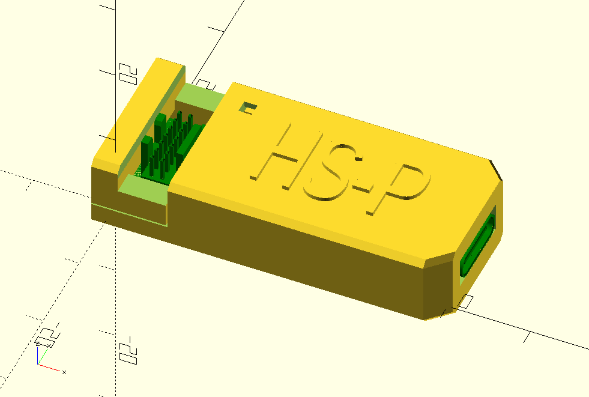

# hs-case-ex

**Not tested for fit with real PCB yet!**

3D printable case for [hs-probe](https://github.com/probe-rs/hs-probe). Print `hs-case-ex.stl` with 100% infill and no supports. There are some bridges but they're not very long.

N.b. the STL file for the PCB (`hs-probe-pcb.stl`) is only in Git LFS because it's ginormous (150MB). It's not required to print or edit the design, only if you want to see how the PCB fits.
